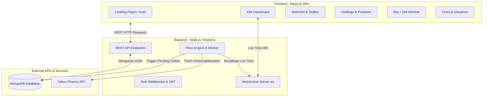

# 📈 Zerodha Kite Clone — Full-Stack Stock Trading Terminal

[](https://reactjs.org/)
[](https://nodejs.org/)
[](https://www.mongodb.com/)
[](https://github.com/websockets/ws)
[](LICENSE)

A high-fidelity, full-stack clone of **Zerodha's Kite Trading Terminal** and **Zerodha Landing Portal**. This project features real-time live price streaming via WebSockets, market simulation with timezone-aware trading hours, hybrid Yahoo Finance data fetching, full GTT (Good Till Triggered) / OCO order matching engines, portfolio management (Holdings, Positions, Funds), and interactive Chart.js visualizations.

---

## 📑 Table of Contents

- [Overview](#-overview)
- [Key Features](#-key-features)
- [System Architecture](#-system-architecture)
- [Tech Stack](#-tech-stack)
- [Project Structure](#-project-structure)
- [API Endpoints & WebSocket Events](#-api-endpoints--websocket-events)
- [Data Models & Database Design](#-data-models--database-design)
- [Getting Started & Installation](#-getting-started--installation)
  - [Prerequisites](#prerequisites)
  - [Backend Setup](#1-backend-setup)
  - [Frontend Setup](#2-frontend-setup)
  - [Environment Variables](#3-environment-variables)
- [Price Engine & Order Execution Logic](#-price-engine--order-execution-logic)
- [Screenshots & Modules](#-screenshots--modules)
- [Future Enhancements](#-future-enhancements)
- [License](#-license)

---

## 🌟 Overview

The **Zerodha Clone** provides both the public-facing promotional website (Landing, Pricing, Products, About, Support) and the core **Kite Trading Dashboard**. It replicates the interface, user experience, and order lifecycle of India's largest discount broker.

### Highlights:
- **Pixel-Perfect Trading Terminal**: Replicated Kite UI design tokens, navigation, watchlist, and order placement window.
- **Dynamic Real-Time Market Ticks**: Live streaming stock price updates delivered through WebSockets.
- **Hybrid Data Pipeline**: Historical quotes from Yahoo Finance API blended with an in-memory random-walk tick simulation during active market hours.
- **Simulated Trading & Margins**: Virtual funds deposit/withdrawal, cash margin checks, real-time P&L calculations, and holding updates upon order triggers.

---

## 🚀 Key Features

### 1. 🏢 Marketing & Landing Portal
- **Home, About, Products, Pricing, and Support**: Modular React pages matching Zerodha's branding and design standards.
- **User Authentication**: Secure Sign-up and Login system with password hashing (`bcrypt`), JWT authentication, and HTTP-only cookie management.

### 2. 📊 Real-Time Watchlist & Top Bar
- **Live Stock Indices**: NIFTY 50 and SENSEX real-time tickers in the sticky top header.
- **Interactive Watchlist**: Hover actions to **Buy**, **Sell**, view **Market Depth**, open **Full Interactive Charts**, and delete/filter items.
- **Color-coded Ticks**: Visual green/red price flash animations on price fluctuations.

### 3. 💼 Comprehensive Portfolio Management
- **Dashboard Summary**: Equity & commodity margins, visual asset allocation breakdown with Donut and Bar charts.
- **Holdings**: Real-time evaluation of long-term investments, calculated day changes, total net P&L, and dynamic percentage returns.
- **Positions**: Intraday active positions tracking with live P&L recalculations based on tick feeds.
- **Orders Book**: Tabbed interface filtering orders by status (`EXECUTED`, `PENDING`, `REJECTED`, `CANCELLED`).
- **Funds Management**: Modal-driven instant fund deposit and withdrawal simulator, updating available trading margin in real time.

### 4. ⚡ Advanced Order Placement & GTT / OCO Engine
- **Order Types**: Market, Limit, SL (Stoploss Limit), and SL-M (Stoploss Market).
- **Product Categories**: Intraday (MIS) and Longterm (CNC).
- **GTT (Good Till Triggered) & Bracket Orders**: Place trades with user-configured Stoploss % and Target % triggers.
- **Automated Order Trigger Matching**: Background service evaluates pending orders against live tick prices and executes trades automatically.

### 5. 📈 Interactive Charting Terminal
- **TradingView-Style Visualizer**: Dedicated full-screen charts with time-series historical data.
- **Live WebSocket Stitching**: Combines historical Yahoo Finance daily closes with real-time incoming tick data.

---

## 🏗️ System Architecture



---

## 💻 Tech Stack

### Frontend
- **Framework**: React 19.x (Single Page Application)
- **Routing**: React Router DOM v7
- **UI Components & Icons**: Material-UI (`@mui/material`, `@mui/icons-material`), Emotion
- **Charts & Visualizations**: Chart.js (`react-chartjs-2`)
- **HTTP Client**: Axios
- **Styling**: Custom CSS & Kite UI Design System

### Backend
- **Runtime & Framework**: Node.js, Express.js 5.x
- **WebSocket Protocol**: `ws` (High-performance WebSocket library)
- **Database ODM**: Mongoose 9.x
- **Authentication**: JSON Web Tokens (`jsonwebtoken`), `bcrypt`, `cookie-parser`, `passport`
- **Market Data**: `yahoo-finance2`

### Database
- **MongoDB**: NoSQL database for flexible document storage (Users, Orders, Holdings, Positions, Funds).

---

## 📂 Project Structure

```
ZERODHA CLONE/
│
├── backend/
│   ├── controllers/
│   │   ├── AuthController.js          # Authentication business logic (Signup/Login)
│   │   └── OrderController.js         # Order creation and retrieval logic
│   ├── middlewares/
│   │   └── AuthMiddleware.js          # JWT verification middleware
│   ├── model/
│   │   ├── FundsModel.js              # Funds collection schema
│   │   ├── HoldingsModel.js           # Holdings collection schema
│   │   ├── OrdersModel.js             # Orders collection schema
│   │   ├── PositionsModel.js          # Positions collection schema
│   │   └── UserModel.js               # User accounts schema
│   ├── routes/
│   │   └── AuthRoute.js               # Authentication routes (/signup, /login, /verify)
│   ├── schemas/                       # Mongoose Schema definitions
│   ├── util/
│   │   └── SecretToken.js             # JWT token generator
│   ├── priceEngine.js                 # WebSocket engine & real-time order trigger worker
│   ├── index.js                       # Express server entry point & REST APIs
│   ├── package.json
│   └── .env.example                   # Environment configuration template
│
├── frontend/
│   ├── public/
│   │   ├── index.html
│   │   └── media/                     # Static images, broker awards, partner logos
│   ├── src/
│   │   ├── dashboard/                 # Kite Trading Dashboard Module
│   │   │   ├── components/
│   │   │   │   ├── BuyActionWindow.js # Order placement modal (Market, Limit, GTT)
│   │   │   │   ├── Dashboard.js       # Main dashboard layout
│   │   │   │   ├── Funds.js           # Fund deposit/withdrawal terminal
│   │   │   │   ├── FullChartPage.js   # Expanded stock chart page
│   │   │   │   ├── GeneralContext.js  # Context API for trading state
│   │   │   │   ├── Holdings.js        # Long-term portfolio table
│   │   │   │   ├── Home.js            # Dashboard home container
│   │   │   │   ├── Menu.js            # Navigation menu
│   │   │   │   ├── Orders.js          # Order book & execution history
│   │   │   │   ├── Positions.js       # Intraday open positions
│   │   │   │   ├── Summary.js         # Equity & commodity summaries
│   │   │   │   ├── TopBar.js          # Indices header (NIFTY 50 / SENSEX)
│   │   │   │   └── WatchList.js       # Live streaming stock watchlist
│   │   │   ├── data/                  # Static stock & watchlist presets
│   │   │   └── dashboard.css          # Kite design system stylesheet
│   │   │
│   │   ├── landing_page/              # Zerodha Marketing Site Module
│   │   │   ├── home/                  # Landing page hero, stats, ecosystem
│   │   │   ├── about/                 # Team and company mission
│   │   │   ├── products/              # Kite, Console, Coin, Varsity previews
│   │   │   ├── pricing/               # Brokerage charges & calculator
│   │   │   ├── support/               # Help center & ticket portal
│   │   │   ├── login/                 # User login form
│   │   │   ├── signup/                # User registration form
│   │   │   ├── Navbar.js
│   │   │   └── Footer.js
│   │   │
│   │   ├── index.js                   # React DOM root & route registrations
│   │   └── index.css                  # Global styles
│   └── package.json
│
├── project_summary.md                 # Executive summary & resume bullet points
└── README.md                          # Project documentation
```

---

## 📡 API Endpoints & WebSocket Events

### REST Endpoints

| Method | Endpoint | Description | Auth Required |
| :--- | :--- | :--- | :---: |
| `POST` | `/signup` | Register a new user | No |
| `POST` | `/login` | Authenticate user & issue JWT cookie | No |
| `POST` | `/verify` | Validate active JWT session | Yes |
| `GET` | `/allHoldings` | Fetch all user stock holdings | Yes / Optional |
| `GET` | `/allPositions` | Fetch all intraday trading positions | Yes / Optional |
| `GET` | `/allOrders` | Fetch list of all submitted orders | Yes / Optional |
| `POST` | `/newOrder` | Place new Market/Limit/SL/GTT order | Yes / Optional |
| `GET` | `/getFunds` | Retrieve current cash & margin balance | Yes / Optional |
| `POST` | `/updateFunds` | Deposit or withdraw trading funds | Yes / Optional |
| `GET` | `/history/:symbol` | Historical price data for charting | No |

### WebSocket Data Stream
- **URL**: `ws://localhost:3002` (or configured backend port)
- **Payload Format**:
```json
{
  "type": "TICK_UPDATE",
  "data": {
    "NIFTY 50": { "price": 24530.20, "change": "+0.45%" },
    "SENSEX": { "price": 80420.15, "change": "+0.32%" },
    "INFY": { "price": 1845.50, "change": "-0.80%" },
    "RELIANCE": { "price": 2980.00, "change": "+1.12%" }
  }
}
```

---

## 🗄️ Data Models & Database Design

### Holdings Schema
```javascript
{
  name: { type: String, required: true },
  qty: { type: Number, required: true },
  avg: { type: Number, required: true },
  price: { type: Number, required: true },
  net: { type: String },
  day: { type: String }
}
```

### Orders Schema
```javascript
{
  name: { type: String, required: true },
  qty: { type: Number, required: true },
  price: { type: Number, required: true },
  mode: { type: String, enum: ['BUY', 'SELL'], required: true },
  orderType: { type: String, enum: ['MARKET', 'LIMIT', 'SL', 'SL-M'] },
  triggerPrice: { type: Number },
  target: { type: Number },
  stopLoss: { type: Number },
  status: { type: String, enum: ['PENDING', 'EXECUTED', 'REJECTED', 'CANCELLED'], default: 'PENDING' },
  createdAt: { type: Date, default: Date.now }
}
```

---

## ⚙️ Getting Started & Installation

### Prerequisites
- **Node.js** (v18.x or higher)
- **npm** or **yarn**
- **MongoDB** running locally or a **MongoDB Atlas** connection string

---

### 1. Backend Setup

1. Open a terminal and navigate to the `backend` folder:
   ```bash
   cd backend
   ```
2. Install dependencies:
   ```bash
   npm install
   ```
3. Create a `.env` file in the `backend/` folder (see [Environment Variables](#3-environment-variables)).
4. Start the backend development server:
   ```bash
   npm run dev
   ```
   *The server starts on port `3002` with both Express and the WebSocket server active.*

---

### 2. Frontend Setup

1. Open a new terminal and navigate to the `frontend` folder:
   ```bash
   cd frontend
   ```
2. Install dependencies:
   ```bash
   npm install
   ```
3. Start the React development server:
   ```bash
   npm start
   ```
   *The client application will open automatically at `http://localhost:3000`.*

---

### 3. Environment Variables

Create a `.env` file in the `backend/` directory:

```env
PORT=3002
MONGO_URL=mongodb://127.0.0.1:27017/zerodha_clone
TOKEN_KEY=your_jwt_secret_key_here
```

---

## 🧠 Price Engine & Order Execution Logic

1. **Hybrid Tick Generator**:
   - Fetches actual market quotes from Yahoo Finance API on initialization.
   - Generates micro-volatility variations using a Gaussian random-walk model every 2 seconds to simulate a live exchange.
2. **Market Hours Awareness**:
   - Adheres to Indian Market hours (09:15 to 15:30 IST, Monday through Friday).
   - Ticks are frozen outside market hours to preserve authentic closing prices.
3. **Automated Trigger Matching**:
   - The price engine periodically scans all `PENDING` Limit and GTT orders.
   - If `Live Price <= Buy Limit` or `Live Price >= Sell Target`, the order status transitions to `EXECUTED`, recalculating average costs, margins, and portfolio holdings.

---

## 🔮 Future Enhancements

- [ ] Multi-exchange symbol search with fuzzy autocomplete.
- [ ] Option chain and derivatives trading interface.
- [ ] Multiple customizable watchlists (Watchlist 1 to 7).
- [ ] Instant UPI payment gateway integration for dummy funds top-up.
- [ ] Technical indicators on Chart.js (RSI, MACD, Bollinger Bands, Moving Averages).

---

## 📄 License

This project is open source and available under the [ISC License](LICENSE).

---

*Disclaimer: This is an educational clone developed for portfolio and learning purposes. It is not affiliated with or endorsed by Zerodha Broking Ltd.*
